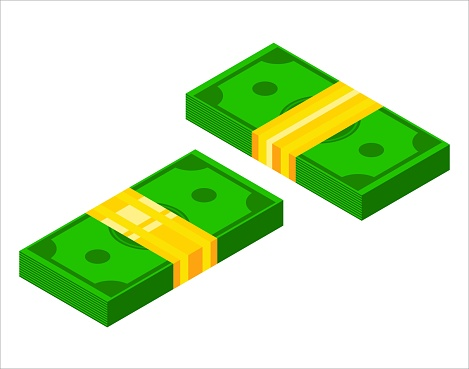

<h3 align="center">

</h3>

<h3 align="center">
  Aplicativo: Troco fácil
</h3>

<blockquote align="center">“Nada no mundo supera a persistência.”!</blockquote>

  

  

  

  <a href="#memo-licença">Licença</a>

## :rocket: Sobre

Esse aplicativo devolve o troco em cedulas (Real) e moedas (Centavos) de acordo com o valor da compra e o valor pago

## :rocket: Demonstração

<h3 align="center">
  
</h3>

## :memo: Licença

Esse projeto está sob a licença MIT. Veja o arquivo [LICENSE](LICENSE) para mais detalhes.

---

Feito com 💜 by Ebner Silva :wave:
